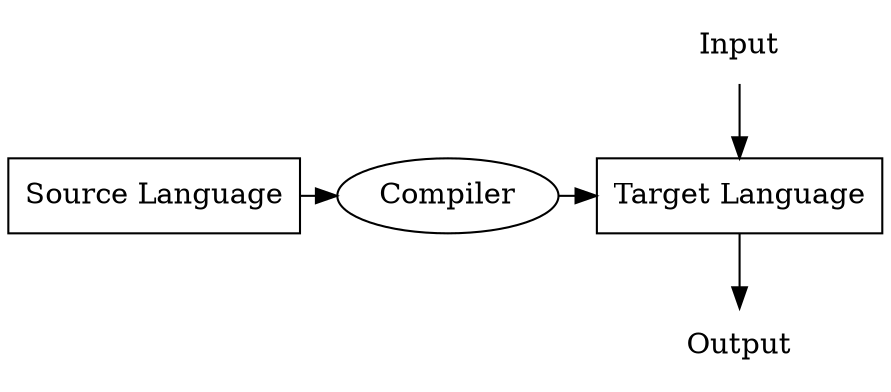

# EECS 483 - Compiler Construction

* Instructor: Lingjia Tang
* GSI: Abhayendra Singh
* Use Piazza
* Project 45%, Midterm 25%, Final: 30%

## About Projects

這學期總共有五個 project，會從 Decaf 編譯成 MIPS

| Projects | Loading | Time |
|----------|----|----|
| P1 | 5% | 1 week |
| P2 | 6% | 2 week |
| P3 | 10% | 3 weeks | 
| P4 | 12% | 3.5 weeks |
| P5 | 12% | 3 weeks |

> **Note**
> 1. Groups member registered before Jan 14.
> 2. Total 3 grace days.

