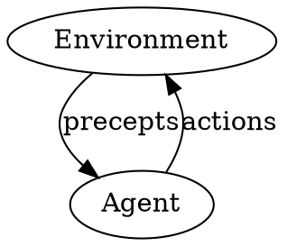

# Lecture 2

## Announcements

- Office hour changed to 10-11am tomorrow
- Seminars (every tuesday 3725BBB 4:10-5:15)

## What are agents?

Goal: How to build these types of agents?

- what about the human agents? they run on behave of somebody.
  - sport agents, actor agents, lawyers, contractors, travel agents, secret agents
- possible examples of computer-based agents?
  - watson: for medical setting instead of jeopardy setting (?)
- why we call them "agents"? instead of programs?
  - keep up with the latest buzzwords.

An Agent program ($$\pi$$): A real-time computable function from observations to actions.

$$ \pi^t: O^{t-1}\to A$$
$$ a_t = \pi^t(\langle o_1, \cdots, o_{t-1}\rangle)$$
$$ \pi = \langle \pi^1, \pi^2, \cdots \rangle $$

### Evaluating agent behavior

examples: spam filter, stock money, crashing into things on driving?

- what do we expecting on the agents?

#### PEAS Description

- P: Performance measure: 要如何衡量成效
- E: Environment: 環境給我們什麼
- A: Actuators: Agent 可以如何影響環境, 可以做什麼?
- S: Sensors: 要如何測量/感知周圍的環境, 可以做到多好?

Example: Google Car

- Performance
  - Get to a place fast or get to a "right" place fast
  - Confidence or Safety
  - profit
- envirnoment limit: weather, highways
- Sensors: wheels, distance sensors, ...
- Actuators: making the engine go, breaking system, controllers...

