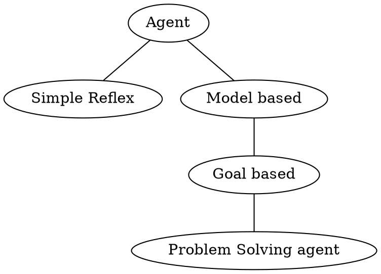

# Lecture 3: Problem solving as Search

- MLK day issue

## Outline

## Agent Design

- Example Utility-Based agent
  - in RPS game, I'm the dealer, so I win a tie.
  - Cards are laid out in a row and we'll play through all three of them.
  - 實物投影機!!

- Route Planning

- Taxonomy of agent types

## States

How many states? How many reachable states?

- Missionaries(傳教士) and Cannibals(吃人的惡魔) 的渡河問題
  - number of states?
    - $$3\times 3\times 3\times 3\times 3 \times 3 \times 3 = 3^7$$ (Each object could be left, right or on the boat).
    - $$2\times 2\times 2\times \cdots = 2^7$$ (Each object just considered to be left or right).
    - $$4\times 4\times 2 = 32 $$.
- 8 Puzzle
- Hanoi Tower
  - $$3\times 3\times 3\times ... = 3^n$$.
- Sudoku Puzzle
  - Multiple solutions...?
- Aces and Eights
  - We need three volunteers
  - "AA" "88" "8A"
  - 1: I don't know, 2: I don't know, 3: Now I know!
  - "Here is no randomness in this class :-)"

## Well defined problems

Consists of:

- Initial state, $$x_{int}$$
- set of available actions (also called operators), defined in terms of successor function
    $$S: state\times state\to state$$
- goal test, a subset of states
- path cost function, $$g$$.

Examples:

- Multilated checkerboard
- The Locker problem (開燈問題, 第 $i$ 個人改變每 $i$ 盞燈的狀態)
